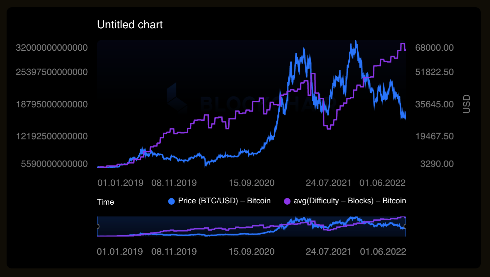
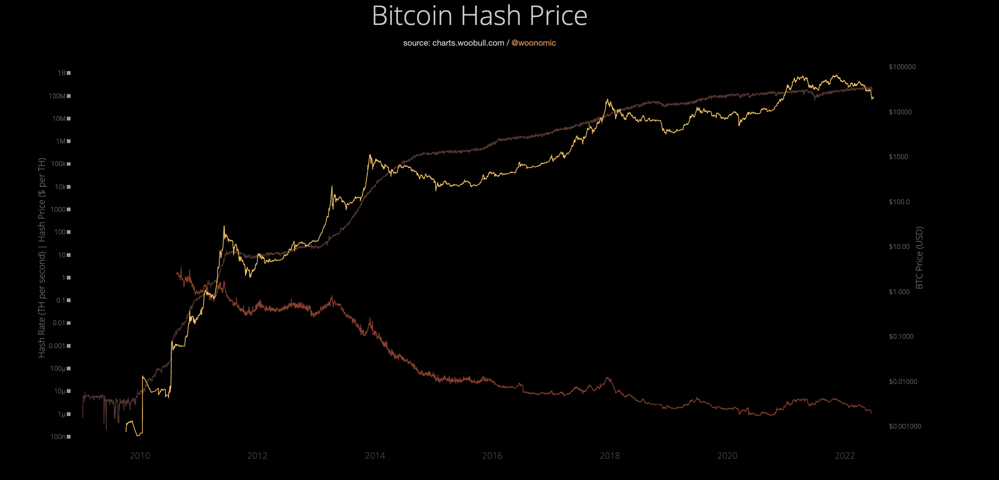

# Haket.info

---

> What is value of Bitcoin?

---

> Bitcoin was intended to be digital money for an ideal perfect market for libertarian capitalists, instead Bitcoin has turned out to primarily benefit bankers and speculators at the expense of the environment and the real economy.

---
> Purely peer-to-peer version of electronic cash would allow online payments to be sent directly from one party to another without going through a financial institution.

Bitcoin Whitepaper, "Satoshi Nakamoto"
---
- Bitcoin was created to be *a new kind of money* rooted in a vision of a market not bound by geography, banks and governments.

- Despite the intentions of its creators, *Bitcoin is not money*.

- It was designed with a *faulty understanding of money*, and as a result has a positive feedback loop that kick-started an asset bubble.

- In order to fix this bug we need to employ the *labour theory of value*.
---
#### The Finance View

Money is a financial instrument.

The value of a financial instrument can come from being redeemable to its issuer, from providing an income stream or from having a collateralized value.

Bitcoin has a "fair value of zero" and is purely speculative, according to this view.

---
#### The Austrian View

Money is a commodity, its value is derived from its use value.

An object cannot be used as money unless it already possesses an objective exchange value based on some other use.

Therefore the austrian view agrees with the finance view that Bitcoin has no value and is purely a speculative asset.

This is ironic given that many Bitcoin proponents imagine they subscribe to Austrian economics, and this is a reason why Bitcoin has a fixed maximum supply, based on a missapplication of the idea of the "gold standard."
---
#### The Classical/Marxist view

Money is a commodity, it's value is derived from its prices of production, which themselves gravitate towards socially necessary labour time.

Applying the classical model to modern "fiat" money is not at all straightforward, however it is very applicable to Bitcoin, and doing so also helps to understand why Bitcoin is broken and thus can not function as money.

---
#### The labour theory of value

<table>
<tr><th>Commodity</th><td>Apples</td><td>Oranges</td></td><td>Coconuts</td></tr>
<tr><th>Hours</th><td>5</td><td>2</td></td><td>10</td></tr>
<tr><th>Coconuts</th><td>0.5</td><td>0.2</td></td><td>1</td></tr>
</table>

> Having a common magnitude, socially neccesary labour time, allows prices to form.
---

<table>
<tr><th>Collectibles</th><td>Baseball Cards</td><td>Postage Stamps</td></td><td>Paintings</td></tr>
<tr><th>Hours</th><td>?</td><td>?</td></td><td>?</td></tr>
<tr><th>Paintings</th><td>?</td><td>?</td></td><td>?</td></tr>
</table>

> Lacking a common magnitude there is no basis for prices to form
---
#### price:work ratio
Commodities are rational, bitcoin and collectibles are irrational.
<table>
<tr><th>Coconuts</th><td>Fungible</td><td>High prices attract more work</td></td><td>More work means more supply</td></tr>
<tr><th>Paintings</th><td>Non Fungible</td><td>High prices do not necessarily attract more work</td></td><td>More work does not create more supply</td></tr>
<tr><th>Bitcoin</th><td>Fungible</td><td>High prices attract more work</td></td><td>More work does not create more supply</td></tr>
</table>
---
#### Market regulated prices

- Coconuts

high prices -> more work attracted -> more supply -> lower prices -> less work -> less supply -> higher prices -> repeat

*Market forces regulate prices*

#### Positive Feedback Loop

- Bitcoin

high prices -> more work attracted -> fixed supply -> higher prices -> repeat

low prices -> less work attracted -> fixed supply -> lower prices -> repeat

*Market forces exacerbate volatility*

---
### Bitcoin's Irrational Block Reward creates a positive feedback loop that makes its value boom and bust
---
- Bitcoin can have a stable value if the block reward is a function of the difficulty, and therefor more work results in more supply

- Without the spectacular boom and bust, it wont attract as much attention and
interest, as it's just a digital payment system and not a get rich quick
scheme

#### Other factors
- Speculation, confidence and the Greater Fool
- Portfolio compositions and the Minsky Moment

---
### Bitcoin is funny money
- in-game money
- Irrational because of the design flaw which dissociates block reward from difficulty / hashing / work

&nbsp;

### HAKET can be a money
- A Rational Cryptocurrency
- block reward is a fixed ratio to the amount of hashing (work)needed to verify the block

---
 
#### Value comes from work

<small>

Where is the work in a blockchain? 
(in Bitcoin) 208915318781930100000 Chip-level operations (Hashes) / s 
Computation is physical work 

</small>

#### Dead & living labour
<small>
<table> <tr> <td center>
	<h4>dead labour </h4>
	<ul><li>computational hardware</li>
		<li>electricity grid / infrastructure</li></ul>
  </td>
<td center> <h4>living labour </h4>
<ul><li>Maintenance</li>
 <li>Office work</li></ul>
  </td></tr></table>
</small>
---

 
over the past few months, for the first time Bitcoin price has sharply declined while difficulty (hashing) has continued to rise. This is likely due to the fact that a new generation of mining ASICs, the AntMiner S19 is making mining significantly more energy efficient. 
	

---

 
hashes have never been cheaper, implying that Bitcoin price is falling towards its cost of production - probabilistically, the proportional cost of all labour input to the computer work to mine each Bitcoin. 
	

	
---

The base value of a Bitcoin is all the work which goes into to maintaining the reliable affordace of Bitcoin as a distributed cryptographically secure transaction service.

---

Services built on the affordance of Bitcoin, based on the value of the work in Bitcoin, add value according to the supplementary labour in the service, generate profits according to the dominant mode (capitalist worker exploitation).

---

There is no new value paradigm in Bitcoin. Bitcoin is a speculative asset who's price is dissociated from its value and so will always be volatile. Same thing for Ethereum. 

---

Haket can provide the same distributed consensus verified append-only ledger without the speculative volatility of Bitcoin. Because it is rational, it's price will always represent a specific quantum of work. 

---

### Lets talk about value at our workshop!
## what it is, and what we need it for!

